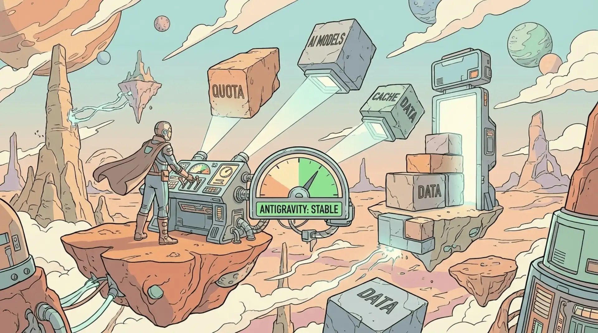
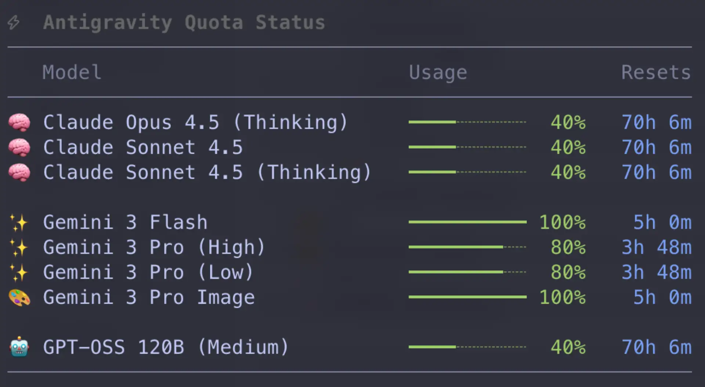

<p align="center">
  
</p>

<div align="center">

# Pi Antigravity Quota

**The missing quota dashboard for Google Cloud Code models in Pi.**

[](https://www.npmjs.com/package/pi-antigravity-quota)
[](LICENSE)
[](https://github.com/mariozechner/pi-coding-agent)

</div>

## Why?

If you use the Antigravity (Google Cloud Code) provider in Pi, you know the struggle: you're coding away, and suddenly models stop responding or switch unpredictably because you've hit a hidden quota.

**Pi Antigravity Quota** solves this by giving you a direct line of sight into your usage. No more guessing if you have 10% or 90% of your daily limit remaining.

## Features

-   **⚡️ Instant Dashboard**: Run `/quota` to see a live snapshot of every model available to your account.
-   **📊 Visual Health Bars**: Color-coded progress bars (Green/Yellow/Red) let you assess capacity at a glance.
-   **⏳ Reset Timers**: Know exactly when your quota renews (e.g., "Reset in 2h 15m").
-   **🧠 Smart Grouping**: Models are automatically organized by family (Claude, Gemini, PaLM) to reduce noise.
-   **🧹 Noise Filtering**: Automatically filters out internal test models and deprecated versions, keeping your view clean.

## Installation

Install directly via `pi` (requires pi v0.50+):

```bash
pi install npm:pi-antigravity-quota
```

Or manually:

```bash
cd ~/.pi/agent/extensions
git clone https://github.com/ditfetzt/pi-antigravity-quota.git
# Restart pi
```

## Usage

Simply run the command in your Pi terminal:

```bash
/quota
```

<p align="center">
  
</p>

## Configuration

This extension is **Zero Config**.

It automatically detects your authenticated session from `~/.pi/agent/auth.json`.

### Troubleshooting

**"Antigravity auth not found"**
- Ensure you have authenticated with the **Antigravity** provider in Pi (check your provider settings).
- Try restarting Pi to refresh the auth state.

**"Failed to fetch quota data"**
- Your auth token may have expired. Try switching models (**Ctrl+P**) or triggering a model generation to refresh the token, then run `/quota` again.

## How It Works

1.  Reads the `access_token` stored in Pi's `auth.json`.
2.  Queries the internal Cloud Code API (`daily-cloudcode-pa.sandbox.googleapis.com`) used by the IDE plugins.
3.  Parses the raw quota signals (fraction remaining, reset timestamp).
4.  Calculates relative times and renders a TUI-friendly report.

## License

MIT
